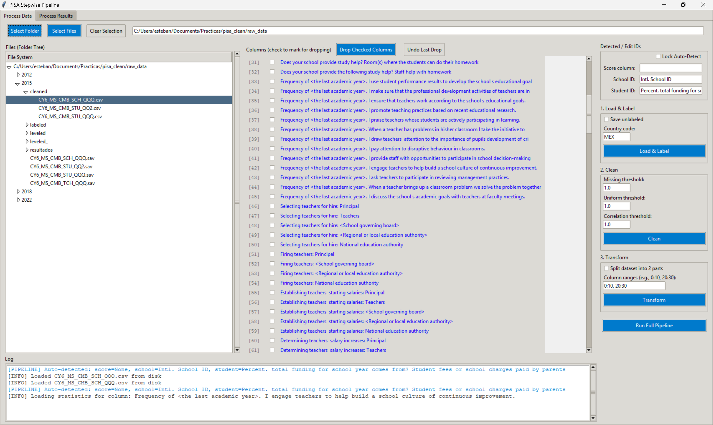
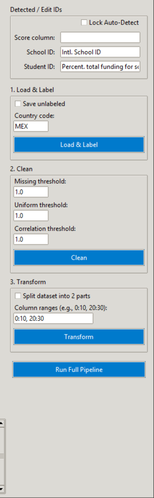
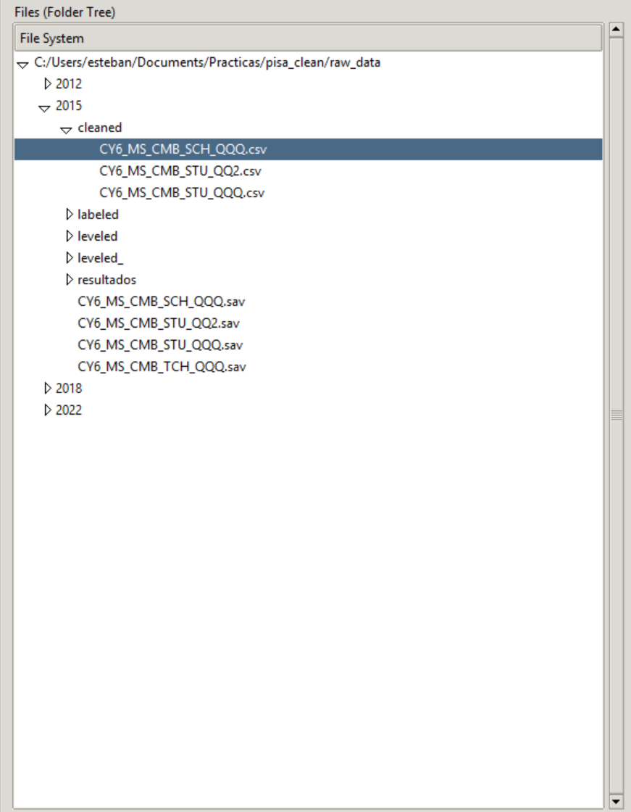

# PISA Data Pipeline

A modular, robust, and user-friendly pipeline for processing PISA (Programme for International Student Assessment) datasets. Designed for researchers and data scientists to easily standardize, clean, and transform educational data for analysis and machine learning.


## ✨ Key Features
- **Two-Tab Interface**: "Process Data" for cleaning raw files, "Process Results" for analyzing feature selection outputs.
- **Smart ID Detection**: Auto-detects Score/School/Student columns (with Lock option).
- **Lazy Loading**: Handles giant file trees instantly without freezing.
- **Thread-safe**: Long operations run in background; UI remains responsive.

---

## 📸 Screenshots

| **Main Interface** | **Settings** |
|:---:|:---:|
|  |  |
| *Intuitive Tabbed Interface* | *Granular Threshold Controls* |

| **Terminal Output** | **File Tree** |
|:---:|:---:|
|  |  |
| *Real-time Thread-safe Logging* | *Lazy-loaded Directory Store* |

---

## 🚀 Quick Start: Command Line Interface (CLI)

For researchers who prefer terminal commands or need to process data in batches, `script.py` is the power tool.

**Basic Usage:**
```bash
python script.py -f "raw_data/2018" -c MEX
```

**Advanced Usage:**
```bash
python script.py -f "raw_data" -mt 0.2 -ut 0.1 -ct 0.95 -sd
```

**Arguments Guide:**
-   `-f, --folder`: Input file or folder path (recursive detection).
-   `-s, --save_unlabel`: Save intermediate unlabeled CSVs.
-   `-c, --country_code`: Country code to filter (e.g., `MEX`, `USA`, `ESP`).
-   `-mt, --missing_threshold`: Drop columns with more than X% missing values (default: 1.0).
-   `-ut, --uniform_threshold`: Drop columns with more than X% same values (default: 1.0).
-   `-ct, --correlation_threshold`: Drop highly correlated columns (default: 1.0 = disabled).
-   `-sd, --split_dataset`: Enable splitting the dataset.
-   `-sr, --split_ranges`: Define split ranges (e.g., `"0:50, 50:100"`).
-   `--only-label` / `--only-clean` / `--only-transform`: Run specific steps only.

---

## 🛠️ GUI User Guide

Launch the app with:
```bash
python main.py
```

The application has **two main tabs**:

---

### TAB 1: Process Data

This tab handles the full ETL (Extract, Transform, Load) pipeline for raw PISA files.

#### 1.1. Top Toolbar
| Button | What it does |
|---|---|
| **Select Folder** | Opens a folder containing PISA data (e.g., `2015/`). The app recursively finds all relevant files. |
| **Select Files** | Opens a file dialog to manually select specific `.sav`, `.sps`, or `.csv` files. |
| **Clear Selection** | Deselects all currently selected files in the tree view. |

#### 1.2. File Tree (Left Panel)
- Displays all files and folders under your selected path.
- Supports **multi-select** (Ctrl+Click or Shift+Click).
- Double-click any CSV to preview its **columns** in the center panel.

#### 1.3. Column Display (Center Panel)
- Shows the list of columns for the currently selected file.
- **Checkboxes**: Mark any column you want to remove.
- **Drop Checked Columns**: Deletes the marked columns from the file and saves a backup.
- **Undo Last Drop**: Restores the file to its state before the last drop (uses the `.backups/` folder).

#### 1.4. Actions Panel (Right Side)

##### Detected / Edit IDs
| Field | Description |
|---|---|
| **Score column** | The column containing math scores (e.g., `PV1MATH`). Auto-detected, but editable. |
| **School ID** | The column linking students to schools (e.g., `CNTSCHID`). |
| **Student ID** | The column uniquely identifying students (e.g., `CNTSTUID`). |
| **Lock Auto-Detect** | If checked, the app will NOT overwrite your manual entries when you select new files. |

##### Step 1: Load & Label
Converts raw SPSS (`.sav`) or legacy (`.sps`+`.txt`) files into human-readable CSVs.

| Option | Description |
|---|---|
| **Save unlabeled** | If checked, also saves a copy of the file BEFORE metadata decoding (useful for debugging). |
| **Country code** | The 3-letter code to filter rows (e.g., `MEX` for Mexico, `USA` for United States). |
| **Load & Label Button** | Starts the loading process. Creates a `labeled/` subfolder with the decoded CSV. |

##### Step 2: Clean
Removes low-quality columns from labeled CSVs.

| Option | Description |
|---|---|
| **Missing threshold (0-1)** | Drops columns with more than X% missing values. E.g., `0.9` drops if >90% values are NaN. |
| **Uniform threshold (0-1)** | Drops columns where X% of values are identical. E.g., `0.95` drops if >95% are the same. |
| **Correlation threshold (0-1)** | Drops one of two columns if their Pearson correlation exceeds X. E.g., `0.99`. Set to `1.0` to disable. |
| **Clean Button** | Runs the cleaning logic. Creates a `cleaned/` subfolder. |

##### Step 3: Transform
Merges Student and School files and converts scores to PISA Proficiency Levels.

| Option | Description |
|---|---|
| **Split dataset into 2 parts** | If checked, splits the final CSV into multiple parts based on column ranges. |
| **Column ranges (e.g., 0:10, 20:30)** | Defines which columns go into each split. Uses Python slice notation. |
| **Transform Button** | Runs the merging and leveling logic. Creates a `leveled/` subfolder with the final ML-ready CSV. |

##### Run Full Pipeline
Runs **Step 1 → Step 2 → Step 3** in sequence for all selected files. Useful for batch processing.

#### 1.5. Log Panel (Bottom)
- Displays real-time logs from all operations.
- Color-coded: blue for pipeline info, red for errors.

---

### TAB 2: Process Results

This tab is for **analyzing the output of feature selection algorithms** (e.g., from Weka or scikit-learn).

#### 2.1. Top Toolbar
| Button | What it does |
|---|---|
| **Select Results Directory** | Chooses the folder containing ranker/selector output files (e.g., `.arff`, `.txt`). |
| **Select CSV File** | Chooses the original dataset CSV (the one used as input to the feature selection). |

#### 2.2. Parameters Panel (Left Side)

| Parameter | Description |
|---|---|
| **Result Names (comma-separated)** | Names of the datasets being analyzed (e.g., `2015_STU, 2015_STU2`). |
| **Essentials (per dataset)** | Variables that are "essential" and should always be included (format: `dataset:col1,col2;dataset2:colA`). |
| **Ranking Filters (comma-separated)** | The ranking algorithms to consider (e.g., `CORR, GAIN, RELIEFF`). These are parsed from filenames. |
| **Selection Filters (comma-separated)** | The selection algorithms to consider (e.g., `subset, wrapper`). |
| **Scoring Weights (comma-separated)** | How to weight each ranking filter in the final score calculation (e.g., `0.25, 0.30, 0.45`). |
| **Number of Selected Attributes** | How many top features to select (e.g., `20` for Top 20). |

#### 2.3. Actions Panel (Right Side)

| Button | What it does |
|---|---|
| **Run Process Results** | Parses all files in the results directory, calculates a weighted average rank for each feature, and displays the top N. |
| **Save Top Selection Results** | Saves two things: 1. A summary CSV of the top N features. 2. A filtered version of the original dataset containing ONLY those top N columns. |

#### 2.4. Results Panel
- Displays a text-based table of the top-ranked features after running "Process Results".
- Shows the feature name, individual scores from each ranker, and the final weighted score.

#### 2.5. Log Panel (Bottom)
- Works identically to the Process Data log.
- Displays progress and any errors from the Process Results operations.

---

## 📦 Installation

1.  **Clone the Repository**
    ```bash
    git clone https://github.com/NiEsteban/pisa.git
    cd pisa_clean
    ```

2.  **Install Dependencies**
    Ensure you have Python 3.10+ installed.
    ```bash
    pip install -r requirements.txt
    ```

---

## 📂 Output Structure

The pipeline uses a non-destructive folder hierarchy:

```text
MyData/
├── 2018/
│   ├── CY07_MST_STU_QQQ.sav        (Raw Input)
│   ├── labeled/
│   │   └── CY07_MST_STU_QQQ.csv    (Step 1 Output)
│   ├── cleaned/
│   │   └── CY07_MST_STU_QQQ.csv    (Step 2 Output)
│   └── leveled/
│       └── CY07_MST_STU_QQQ.csv    (Final Output)
```

---

## 📄 License
IPN-CIC License.
